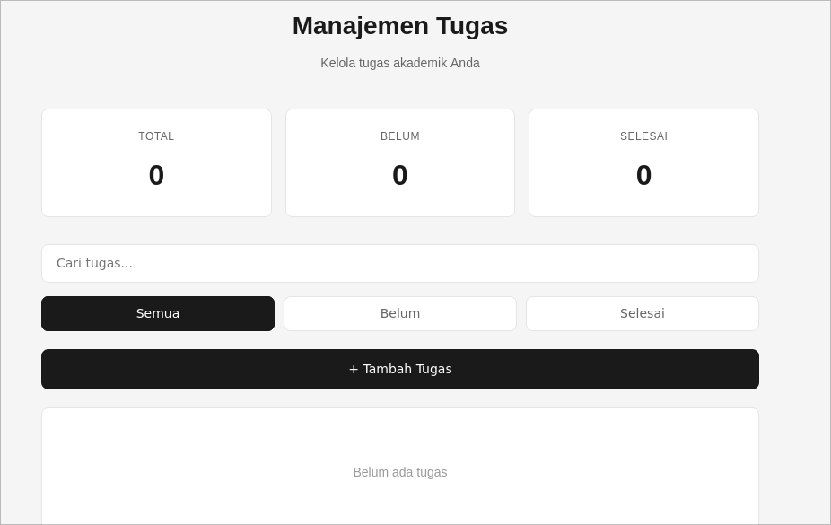
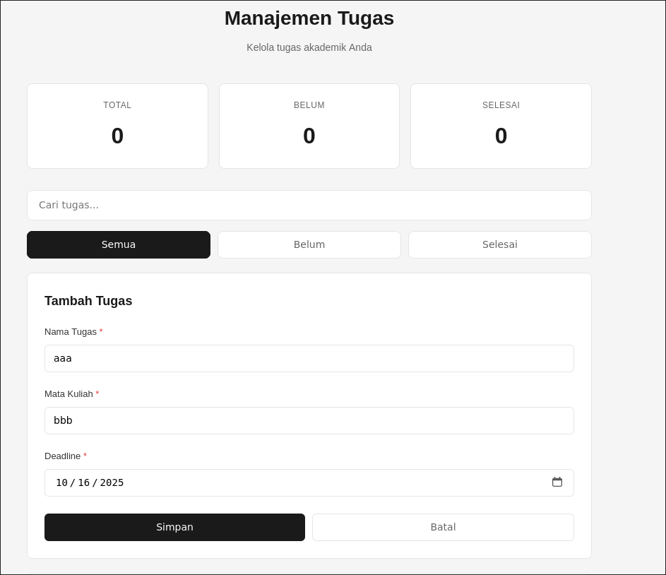

# 📚 Aplikasi Manajemen Tugas Mahasiswa

Aplikasi web sederhana untuk membantu mahasiswa mengelola tugas akademik dengan efisien.

---

## 📖 Tentang Aplikasi

Aplikasi ini memungkinkan mahasiswa untuk mencatat, mengatur, dan melacak tugas-tugas kuliah mereka. Data disimpan secara permanen di browser menggunakan localStorage, sehingga tidak memerlukan koneksi internet atau server.

## ✨ Fitur yang Diimplementasikan

### 1. **CRUD Operations (Create, Read, Update, Delete)**
- ➕ Tambah tugas baru (nama tugas, mata kuliah, deadline)
- 👁️ Lihat semua tugas dalam bentuk card
- ✏️ Edit informasi tugas
- 🗑️ Hapus tugas dengan konfirmasi

### 2. **Validasi Form**
- Nama tugas tidak boleh kosong
- Mata kuliah wajib diisi
- Deadline harus valid dan tidak boleh tanggal yang sudah lewat
- Pesan error yang jelas untuk setiap field

### 3. **Penyimpanan Data (localStorage)**
- Data tersimpan permanen di browser
- Auto-save setiap kali ada perubahan
- Data tetap ada meskipun browser ditutup

### 4. **Filter & Pencarian**
- Filter berdasarkan status (Semua, Belum Selesai, Selesai)
- Search box untuk mencari tugas berdasarkan nama atau mata kuliah
- Real-time filtering

### 5. **Dashboard Statistik**
- Total jumlah tugas
- Jumlah tugas belum selesai
- Jumlah tugas selesai
- Update otomatis setiap ada perubahan

### 6. **Fitur Tambahan**
- Toggle status selesai/belum dengan checkbox
- Alert visual untuk deadline mendesak (≤ 3 hari)
- Format tanggal bahasa Indonesia
- Desain minimalist dan responsive

---

## 📸 Screenshot Aplikasi

### 1. Dashboard & Statistik

*Tampilan utama dengan dashboard statistik yang menampilkan total tugas, tugas belum selesai, dan tugas selesai*

### 2. Form Input Tugas

*Form untuk menambah/edit tugas dengan 3 field: nama tugas, mata kuliah, dan deadline*

### 3. Daftar Tugas dengan Filter

*Daftar tugas dengan fitur search, filter berdasarkan status, dan action buttons (edit & delete)*

### 4. Validasi Form

*Error message muncul saat field kosong atau deadline tidak valid*

### 5. localStorage di DevTools

*Data tersimpan di localStorage browser (DevTools > Application > Local Storage)*

---

## 🚀 Cara Menjalankan Aplikasi

### Langkah 1: Persiapan File
Pastikan ketiga file berada dalam satu folder:
```
my-task-app/
├── index.html
├── style.css
└── script.js
```

### Langkah 2: Aktifkan localStorage
Buka file `script.js` dan **uncomment** (hapus tanda `//`) pada 4 baris berikut:

- **Baris 9:** Load data dari localStorage
- **Baris 159:** Simpan saat tambah/edit tugas
- **Baris 177:** Simpan saat hapus tugas
- **Baris 187:** Simpan saat toggle status

### Langkah 3: Jalankan Aplikasi
- Double-click file `index.html`, atau
- Klik kanan → Open with → Pilih browser, atau
- Drag file `index.html` ke browser

### Langkah 4: Verifikasi localStorage
1. Buka DevTools (tekan F12)
2. Pilih tab **Application** (Chrome) atau **Storage** (Firefox)
3. Klik **Local Storage** di sidebar
4. Lihat key `tasks` dengan data JSON

---

## 🔧 Penjelasan Teknis

### 1. localStorage

**Apa itu localStorage?**
localStorage adalah API browser untuk menyimpan data secara permanen dalam bentuk key-value pairs.

**Cara Kerja:**
- Data disimpan dalam format JSON string
- Kapasitas: 5-10 MB per domain
- Data persisten (tidak hilang saat browser ditutup)
- Hanya bisa diakses dari browser yang sama

**Implementasi di Aplikasi:**

| Operasi | Fungsi | Keterangan |
|---------|--------|------------|
| **Simpan** | `localStorage.setItem('tasks', JSON.stringify(tasks))` | Convert array ke JSON string lalu simpan |
| **Ambil** | `JSON.parse(localStorage.getItem('tasks'))` | Ambil JSON string lalu convert ke array |
| **Hapus** | `localStorage.removeItem('tasks')` | Hapus data tasks |

**Kapan Data Disimpan:**
- Saat menambah tugas baru
- Saat mengedit tugas
- Saat menghapus tugas
- Saat mengubah status selesai/belum

**Format Data:**
```json
[
  {
    "id": 1729123456789,
    "nama": "Essay Filsafat Pendidikan",
    "mataKuliah": "Pemrograman Web",
    "deadline": "2024-10-30",
    "selesai": false,
    "tanggalDibuat": "2024-10-16T10:30:00.000Z"
  }
]
```

---

### 2. Validasi Form

**Tujuan Validasi:**
- Memastikan data lengkap dan valid
- Mencegah error saat pemrosesan
- Memberikan feedback yang jelas ke user

**Aturan Validasi:**

| Field | Validasi | Error Message |
|-------|----------|---------------|
| Nama Tugas | Tidak boleh kosong | "Nama tugas wajib diisi" |
| Mata Kuliah | Tidak boleh kosong | "Mata kuliah wajib diisi" |
| Deadline | Harus diisi & tidak boleh tanggal lewat | "Deadline tidak valid" |

**Proses Validasi:**
1. User klik tombol "Simpan"
2. Sistem cek setiap field (nama, mata kuliah, deadline)
3. Jika ada error:
   - Tampilkan border merah pada field
   - Tampilkan pesan error di bawah field
   - Stop proses simpan
4. Jika semua valid:
   - Simpan data ke array
   - Update localStorage
   - Render ulang tampilan
   - Tutup form

**Validasi Khusus Deadline:**
- Cek apakah field diisi
- Bandingkan dengan tanggal hari ini
- Reject jika tanggal sudah lewat
- Accept jika tanggal hari ini atau masa depan

---

## 📁 Struktur Project

```
aplikasi-manajemen-tugas/
│
├── index.html          # Struktur HTML (layout, form, task list)
├── style.css           # Styling minimalist (monochrome design)
└── script.js           # Logika aplikasi (CRUD, validasi, localStorage)
```

**Teknologi yang Digunakan:**
- HTML5
- CSS3 (Responsive Design)
- JavaScript Vanilla (ES6)
- localStorage API

---

## 🌐 Browser yang Didukung

| Browser | Versi Minimum |
|---------|---------------|
| Chrome | 4+ |
| Firefox | 3.5+ |
| Safari | 4+ |
| Edge | 12+ |
| Opera | 10.5+ |

---

## ❓ FAQ

**Q: Apakah data aman?**  
A: Data tersimpan di browser Anda sendiri, tidak dikirim ke server manapun.

**Q: Apakah bisa diakses dari HP/komputer lain?**  
A: Tidak. localStorage hanya tersimpan di browser yang digunakan.

**Q: Bagaimana jika clear browser data?**  
A: Data akan hilang. Backup dengan copy data dari DevTools > Local Storage.

**Q: Apakah perlu internet?**  
A: Tidak. Aplikasi 100% offline setelah file ada di komputer.

**Q: Berapa banyak tugas yang bisa disimpan?**  
A: Sekitar 25,000+ tugas (limit localStorage 5-10 MB).

---

## 📝 Lisensi

Project ini dibuat untuk keperluan tugas praktikum dan pembelajaran.

---

**Dibuat untuk Tugas Praktikum - Pemrograman Web**
