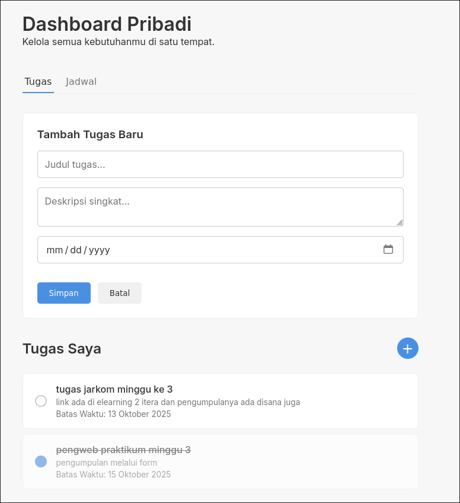
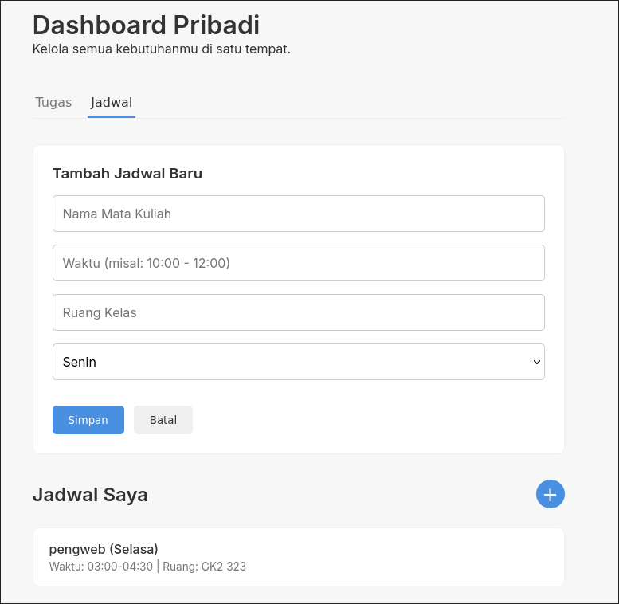

# 🧭 Personal Dashboard Sederhana

**Personal Dashboard** adalah aplikasi web sederhana yang berfungsi sebagai papan tulis digital untuk mengelola **daftar tugas harian (to-do list)** dan **jadwal kuliah**.  
Aplikasi ini dibangun sepenuhnya menggunakan **HTML, CSS, dan JavaScript (ES6+)** tanpa framework atau library eksternal, dan semua data disimpan secara **lokal di browser** menggunakan `LocalStorage`.

---

## 🧩 Penjelasan Aplikasi & Fitur

Aplikasi ini dirancang untuk membantu pengguna mengatur aktivitas harian dengan cepat dan efisien langsung dari browser.

### 🎯 Fitur Utama

#### ✅ Manajemen Tugas
- Menambah tugas baru dengan **judul**, **deskripsi**, dan **tanggal deadline**  
- Mengedit tugas yang sudah ada  
- Menandai tugas sebagai **selesai**  
- Menghapus tugas  

#### 📚 Manajemen Jadwal
- Menambah jadwal kuliah atau kegiatan baru dengan **nama mata kuliah**, **hari**, **waktu**, dan **ruang**  
- Mengedit atau menghapus jadwal yang sudah terdaftar  

#### 🧭 Navigasi Tab
Antarmuka sederhana dengan dua tab: **Tugas** dan **Jadwal**, untuk memudahkan navigasi antar fitur.

#### 💾 Penyimpanan Lokal
Semua data tersimpan di **LocalStorage**, sehingga tidak hilang meskipun browser ditutup atau halaman direfresh.

---

## 🖼️ Tampilan Aplikasi

> 
> 


Desain aplikasi mengusung tema **minimalis dan responsif**, dengan fokus pada kemudahan penggunaan serta keterbacaan data.

---

## ⚙️ Implementasi Fitur ES6+

Aplikasi ini sepenuhnya menggunakan fitur modern dari **JavaScript ES6+** untuk menjaga kode tetap bersih, ringkas, dan efisien.

### 🧱 1. `let` dan `const`
- `const` digunakan untuk variabel yang **tidak berubah**, seperti referensi elemen DOM dan objek penyimpanan.
- `let` digunakan untuk variabel yang **dinamis**, seperti daftar tugas (`semuaTugas`) dan tab yang sedang aktif (`tabAktif`).

---

### 🧩 2. `class`
Struktur kode dibangun dengan class agar data lebih terorganisir:
- `class Tugas` → merepresentasikan satu item tugas.  
- `class Jadwal` → merepresentasikan satu item jadwal.  
- `class Penyimpanan` → menangani proses simpan dan ambil data dari `LocalStorage`.

---

### 🧾 3. Template Literals (`` ` ``)
Digunakan untuk membuat string HTML secara dinamis di fungsi `renderTugas()` dan `renderJadwal()`:

```js
const tugasHTML = semuaTugas.map(tugas => `
  <div class="item ${tugas.selesai ? 'completed' : ''}" data-id="${tugas.id}">
    <div class="item-title">${tugas.judul}</div>
    <div class="item-desc">${tugas.deskripsi}</div>
  </div>
`).join('');
```
### 🔄 4. Async/Await

Walaupun LocalStorage bersifat sinkron, async/await digunakan untuk mensimulasikan operasi asynchronous, seperti seolah-olah mengambil data dari server:
```js
formTugas.addEventListener('submit', async (event) => {
  event.preventDefault();
  await Penyimpanan.simpanTugas();
});
```
### ⚡5. Arrow Functions (=>)

Arrow function digunakan di banyak tempat agar kode lebih ringkas dan mudah dibaca. Berikut contohnya:

- Listener utama dokumen : 
```js
document.addEventListener('DOMContentLoaded', () => {
  // Semua kode aplikasi dijalankan di sini
});
```
---
- Listener tombol tab :
```js
semuaTombolTab.forEach(tombol => {
  tombol.addEventListener('click', () => { /* ubah tab aktif */ });
});

```
---
- Callback untuk .map()
```js
const tugasHTML = semuaTugas.map(tugas => `<li>${tugas.nama}</li>`);

```
---
- Callback untuk .find() dan .filter()
```js
semuaTugas.find(t => t.id === id);
semuaTugas = semuaTugas.filter(t => t.id !== id);

```
---
