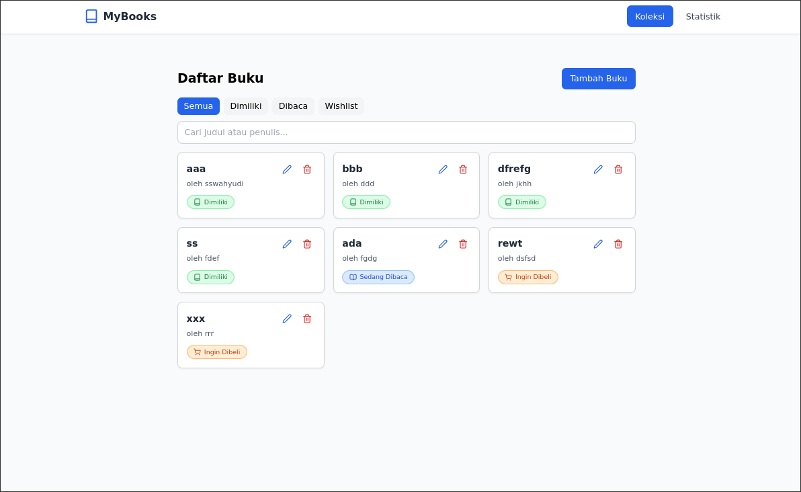
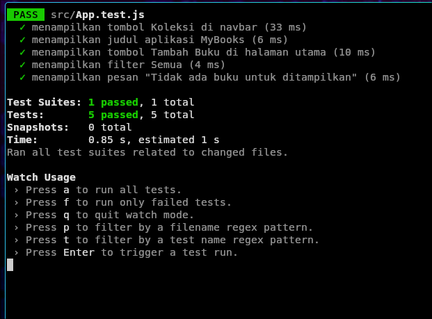

# 📚 Aplikasi Manajemen Buku Pribadi

Aplikasi ini dibuat menggunakan **ReactJS** untuk membantu pengguna mengelola daftar buku pribadi.  
Pengguna dapat mencatat buku yang dimiliki, sedang dibaca, atau ingin dibeli dengan mudah.  
Aplikasi ini menyimpan data secara lokal menggunakan **localStorage** sehingga tidak hilang saat browser ditutup.

---

##🖼️ Tampilan Antarmuka



## 🚀 Fitur Utama

### 1. Manajemen Buku
- ✅ Tambah buku baru (judul, penulis, dan status)
- ✏️ Edit data buku
- 🗑️ Hapus buku dari daftar

### 2. Filter & Pencarian
- 🔍 Cari buku berdasarkan judul
- 🧩 Filter berdasarkan status:
  - Dimiliki
  - Sedang Dibaca
  - Ingin Dibeli

### 3. Statistik Buku
- 📈 Lihat jumlah total buku
- 📊 Statistik jumlah buku berdasarkan status (milik, baca, beli)

### 4. Penyimpanan Data
- 💾 Menggunakan **localStorage** agar data tetap tersimpan meski halaman direfresh

---

## 🧩 Teknologi yang Digunakan

| Teknologi | Kegunaan |
|------------|-----------|
| ReactJS | Framework utama |
| Context API | Manajemen state global |
| React Router DOM | Navigasi antar halaman |
| TailwindCSS | Styling UI modern |
| Lucide Icons | Ikon responsif dan ringan |
| React Testing Library | Pengujian unit komponen |
| localStorage | Penyimpanan data lokal browser |

---

## 🧠 Konsep React yang Diterapkan

- **Functional Components** dengan Hooks (`useState`, `useEffect`)
- **Context API** untuk mengelola daftar buku secara global
- **Custom Hooks**:
  - `useLocalStorage()` → menyimpan data di browser
  - `useBookStats()` → menghitung statistik buku
- **React Router** (`BrowserRouter`, `Routes`, `Route`) untuk navigasi multi-halaman
- **Error Handling** pada form (validasi input)
- **Reusable Components**: `BookForm`, `BookList`, `BookCard`, `BookFilter`

---

## 🧰 Instalasi & Menjalankan

### 1️⃣ Clone Repository
```bash
git clone https://github.com/username/my-react-app.git
cd my-react-app
```

### 2️⃣ Instal Dependensi
```bash
npm install
```

### 3️⃣ Jalankan Aplikasi
```bash
npm start
```

## 🧪 Testing
🔹Tools
React Testing Library (@testing-library/react)

Jest (sudah termasuk dalam Create React App)

🔹Cara Menjalankan Test
```bash
npm test
```

### Hasil

