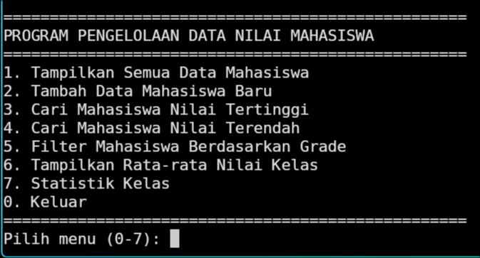
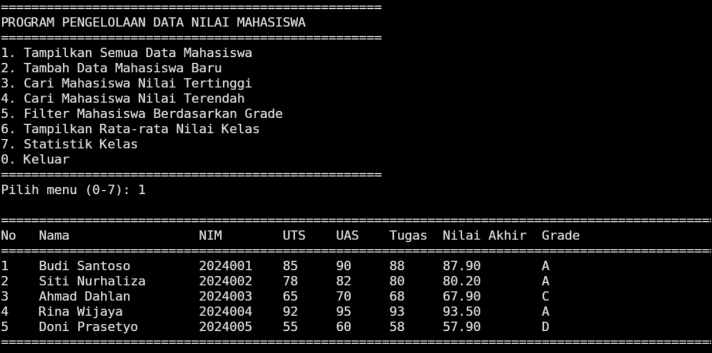
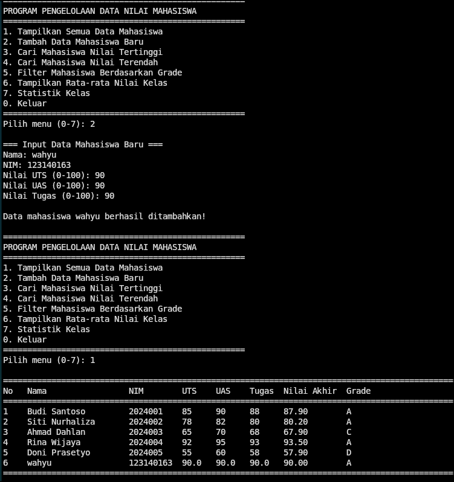

## 📚 Sistem Manajemen Perpustakaan

Sistem manajemen perpustakaan sederhana berbasis Python yang menerapkan konsep Object-Oriented Programming (OOP) secara lengkap.
###📋 Deskripsi Program
Program ini adalah aplikasi console interaktif untuk mengelola koleksi perpustakaan yang mencakup buku dan majalah. Sistem ini dibangun dengan fokus pada penerapan prinsip-prinsip OOP seperti:

Abstraction - Abstract base class untuk item perpustakaan
Inheritance - Pewarisan dari class induk ke subclass
Encapsulation - Penggunaan access modifiers (private/protected)
Polymorphism - Method yang sama dengan implementasi berbeda

## ✨ Fitur Utama

1. 📖 Manajemen Koleksi

Tambah Buku Baru - Input interaktif untuk menambahkan buku dengan validasi lengkap
Tambah Majalah Baru - Input interaktif untuk menambahkan majalah
Validasi Data - Memastikan ID unik, format data benar, dan tidak ada duplikasi

2. 🔍 Sistem Pencarian Advanced

Pencarian berdasarkan ID - Cari item spesifik dengan ID unik
Pencarian berdasarkan Judul - Mendukung partial match (case-insensitive)
Pencarian berdasarkan Penulis - Khusus untuk koleksi buku
Filter berdasarkan Tipe - Tampilkan hanya buku atau majalah
Filter Ketersediaan - Tampilkan item yang tersedia untuk dipinjam

3. 📤 Manajemen Peminjaman

Pinjam Item - Sistem peminjaman dengan validasi ketersediaan
Kembalikan Item - Proses pengembalian item yang dipinjam
Status Tracking - Monitoring status setiap item (tersedia/dipinjam)

4. 📊 Statistik & Reporting

Total koleksi perpustakaan
Jumlah item tersedia dan dipinjam
Breakdown berdasarkan tipe (buku/majalah)
Dashboard statistik real-time

## tampilan
# Tampilan awal

# Menambahkan buku

# Searching buku

# List semua buku

